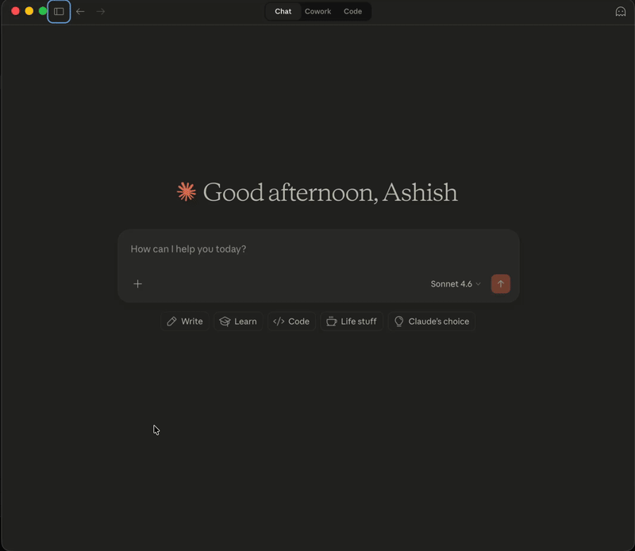

# Neurospicy

Educational skills for AI assistants — built for neurodivergent kids. Engagement-first worksheets and learning tools designed to work with ADHD brains, not against them.

## What's Included

### Plugin: `elementary-ed`

| Skill | Description | Grades |
|-------|-------------|--------|
| `math-worksheet` | Generates print-ready math worksheets with colorful themes, mixed problem types, fun facts, and word root factoids | 2–5 |

Worksheets are output as HTML files optimized for US Letter paper. Open in any browser and print.

---

## Installation

### Claude Desktop

1. Open Claude Desktop
2. Click the **+** button next to the prompt box → **Plugins**
3. Go to **Marketplaces** → **Add marketplace**
4. Enter: `virmani/neurospicy`
5. Go to **Discover** → find **elementary-ed** → click **Install**
6. Restart Claude Desktop

### Claude Cowork (in Claude Desktop)

Claude Cowork is the AI coding workspace built into Claude Desktop. It supports plugins the same way Claude Code does.



1. Open a Cowork session in Claude Desktop
2. Type `/plugin marketplace add virmani/neurospicy` and press Enter
3. Type `/plugin install elementary-ed@neurospicy` and press Enter
4. Type `/reload-plugins` to activate

### Claude Code — from the terminal

```bash
claude plugin marketplace add virmani/neurospicy
claude plugin install elementary-ed
```

### Claude Code — from inside a session

Type these directly in your Claude Code chat:

```
/plugin marketplace add virmani/neurospicy
/plugin install elementary-ed@neurospicy
/reload-plugins
```

### Claude.ai (web)

Plugin installation isn't supported on the web. Instead, open the [math-worksheet skill](./elementary-ed/skills/math-worksheet/SKILL.md), copy the full contents, and paste it at the start of your conversation as instructions.

---

## Using the Math Worksheet Skill

Once installed, invoke it from any Claude session using plain English:

```
/elementary-ed:math-worksheet
- Multiplication facts from number 2 to number 6
- Three-digit addition and subtraction with grouping and borrowing
- A couple of word problems
- Mental addition and subtraction
The theme should be unicorns and castles.
```

```
/elementary-ed:math-worksheet
Mixed fractions, word problems, and multiplication.
Space theme, grade 4, 20 problems.
```

```
/elementary-ed:math-worksheet
Multiplication tables for 3, 4, and 7.
Make it about dinosaurs!
```

**What you can specify:**
- Problem types (multiplication, addition, subtraction, fractions, word problems, mental math)
- Theme (space, dinosaurs, unicorns, ocean, superheroes — or make one up)
- Grade level (2–5, defaults to 3rd grade)
- Number of problems (Claude decides if omitted)

**Output:** A self-contained HTML file. Open it in any browser and print (Cmd+P / Ctrl+P). Set paper size to US Letter and turn off headers/footers for best results.

---

## Contributing

Have a skill idea? Pull requests welcome.

1. Fork this repo
2. Create your skill under `elementary-ed/skills/<skill-name>/SKILL.md` (or add a new plugin folder for a different subject area)
3. Open a PR with a sample output

---

## License

MIT
